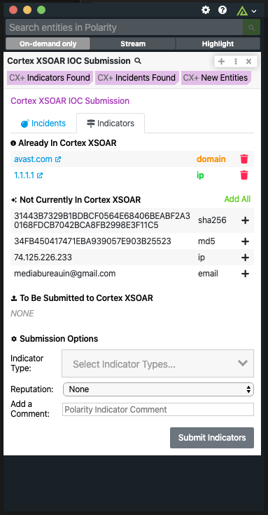

# Polarity Cortex XSOAR IOC Submission Integration

The Polarity Cortex XSOAR IOC Submission integration allows Polarity to search your instance of Cortex XSOAR to return found domains, IPs, hashes, and emails.  The integration also allows you to Create and Delete Indicators and Incidents (IOCs) in bulk from Cortex XSOAR.

  
  

## Cortex XSOAR IOC Submission Integration Options

### Cortex XSOAR Instance URL

The base URL for the Cortex XSOAR API which should include the schema (i.e., https://)

### API Key

A valid Cortex XSOAR API Key which can be found in your Cortex XSOAR Dashboard Settings.

### Allow Indicator Deletion

If checked, users will be able to delete an Indicator from Cortex XSOAR. (this setting must be set to `User can view only`).

> ***NOTE***: When you delete an Indicator you are doing a deletion of the Indicator from the entire system.

### Allow Incident Deletion

If checked, users will be able to delete an Incident from Cortex XSOAR. (this setting must be set to `User can view only`).

> ***NOTE***: When you delete an Incident you are doing a deletion of the Incident from the entire system.

## Installation Instructions

Installation instructions for integrations are provided on the [PolarityIO GitHub Page](https://polarityio.github.io/).

## Polarity

Polarity is a memory-augmentation platform that improves and accelerates analyst decision making.  For more information about the Polarity platform please see:

https://polarity.io/
